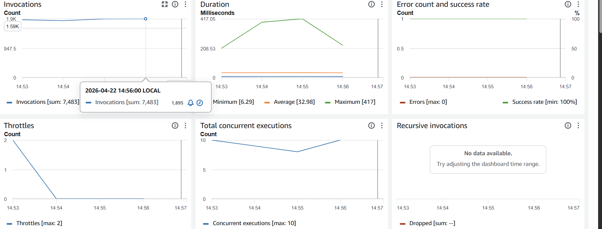
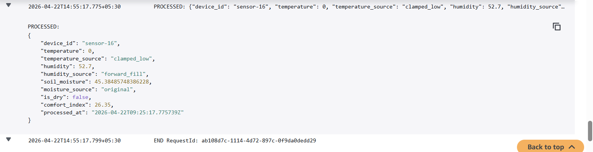
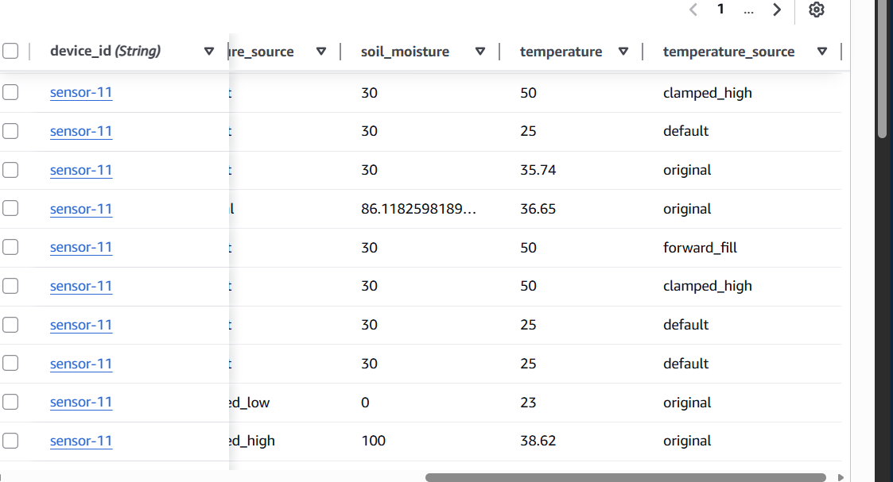
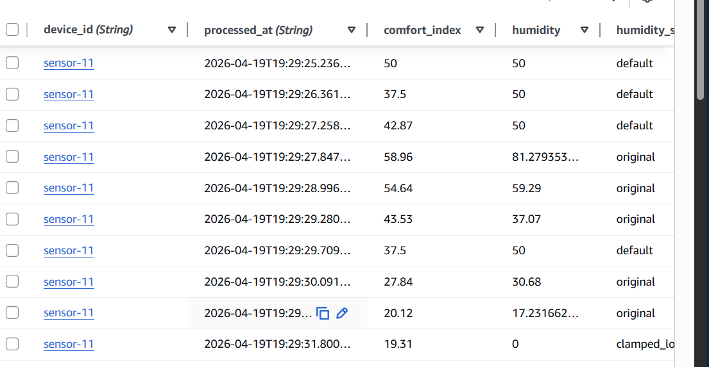

# 🌾 Real-Time IoT Streaming Data Pipeline (AWS)

## 🚀 Overview

This project demonstrates a **real-time IoT data pipeline** built using AWS services.
It simulates multiple IoT sensors generating noisy data and processes it using a scalable, event-driven architecture.

---

## 🧠 Architecture

```
Sensors (Python Simulator)
        ↓
AWS IoT Core (MQTT)
        ↓
IoT Rule (Routing)
        ↓
AWS Lambda (ETL Processing)
        ↓
DynamoDB (Storage)
        ↓
CloudWatch (Monitoring)
```

---

## 🔥 Key Features

* Real-time data streaming using MQTT
* Multi-threaded sensor simulation
* Handles dirty data:

  * null values
  * NaN values
  * out-of-range values
* Smart preprocessing:

  * forward fill (time-aware)
  * clamping (range correction)
* Feature engineering:

  * dryness detection
  * comfort index
* Time-series storage using DynamoDB
* Monitoring via CloudWatch

---

## ⚙️ Technologies Used

* AWS IoT Core
* AWS Lambda
* DynamoDB
* CloudWatch
* Python

---

## 📊 Data Processing Logic

* Missing values → forward fill (last known value)
* Out-of-range → clamped to valid range
* Invalid values → replaced with fallback defaults
* Each transformation is tracked (data lineage)

---

## � Lambda Monitoring Metrics for Preprocessing




---
## 📋 System Logs - Data Flow Pipeline




---
## 💾 Data Storage in DynamoDB





---

## �📁 Project Structure

```
lambda/        → ETL processing logic
simulator/     → sensor data generator
docs/          → architecture diagrams
```

---

## ▶️ How to Run

1. Configure AWS IoT Core (Thing + Certificates)
2. Update endpoint and certificate paths in simulator
3. Deploy Lambda function
4. Create IoT Rule to trigger Lambda
5. Run sensor simulator:

```bash
python streaming_sensor_simulator.py
```

---

## 🎯 Use Case

This system can be used for:

* Smart agriculture
* Environmental monitoring
* Real-time analytics pipelines

---

## 🧠 Learnings

* Designed a real-time event-driven system
* Implemented robust ETL preprocessing
* Worked with AWS IoT + serverless architecture
* Built scalable data ingestion pipeline

---

## 🚀 Future Improvements

* Add S3 data lake
* Build real-time dashboard
* Add anomaly detection

---
